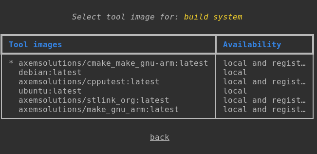
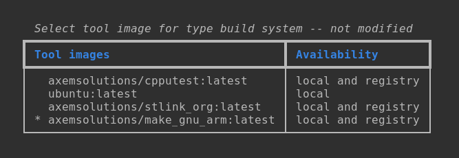

## **`dem list`**

List the Development Environments available locally or for the organization.

Options:

- Level 1:
    - `--local` Scope is the local host.
    - `--all` Scope is the organization.
- Level 2:
    - `--env` List the Development Environments.
    - `--tool` List the tool images.

!!! abstract "The following option combinations are supported:"

    `--local --env` -> List the local Development Environments.  
    `--all --env` -> List the organization's Development Environments.  
    `--local --tool` -> List the local tool images.  
    `--all --tool` -> List the tool images available in the organization's registry.  

---

## **`dem info DEV_ENV_NAME`**

Get information about the specified Development Environment.

Arguments:

`DEV_ENV_NAME` Name of the Development Environment to get info about. [required]

---

## **`dem pull DEV_ENV_NAME`**

Pull all the required containerized tools (which are not yet available on the host PC) from the 
registry and install the Development Environment locally.

    If a Development Environment with the same name, but different description has been already 
    available on the host PC, it gets overwritten with the new one.
    If the same Development Environment is already installed, but the installation is not complete, 
    the missing tool images get obtained from the registry.

Arguments:

`DEV_ENV_NAME` Name of the Development Environment to install. [required]

---

## **`dem create DEV_ENV_NAME`**

Create a new Development Environment.

Running this command will open up an interactive UI on the command line. Follow the steps below to 
configure the new Environment.

1. First you need to select the tool types. You can navigate with the :material-arrow-up: and 
:material-arrow-down: or :material-alpha-k: and :material-alpha-j: keys. Select the required 
tool types with :material-keyboard-space:. Press :material-keyboard-return: when you're done with 
the selection.

    

2. Assign the required tool images for the selected types. You can navigate with the 
:material-arrow-up: and :material-arrow-down: or :material-alpha-k: and :material-alpha-j: keys. 
Select the required tool image and press :material-keyboard-return:.

    

Arguments:

`DEV_ENV_NAME` Name of the Development Environment to create. [required]

---

## **`dem rename DEV_ENV_NAME NEW_DEV_ENV_NAME`**

Rename the Development Environment.

Arguments:

`DEV_ENV_NAME`      Name of the Development Environment to rename. [required]  
`NEW_DEV_ENV_NAME`  The new name.  [required]

---

## **`dem modify DEV_ENV_NAME`**

Modify the tool types and required tool images of an existing Development Environment.

1. The dem shows a list of the already selected tools. You can modify the selection. You can 
navigate with the :material-arrow-up: and :material-arrow-down: or :material-alpha-k: and 
:material-alpha-j: keys. Modify the required tool types with :material-keyboard-space:. Press 
:material-keyboard-return: when you're done with the selection.

    

2. Assign the required tool images for the selected types. You can navigate with the 
:material-arrow-up: and :material-arrow-down: or :material-alpha-k: and :material-alpha-j: keys. 
Select the required tool image and press :material-keyboard-return:.  
If a tool type is already part of the current Development Environment, the original tool image 
gets preselected - you only need to press :material-keyboard-return: if you don't want to change it.

    

Arguments:

`DEV_ENV_NAME` Name of the Development Environment to modify. [required]

---

## **`dem delete DEV_ENV_NAME`**

Delete the selected Development Environment. After the deletion, dem checks whether a tool image is 
required or not by any of the remaining local Development Environments. In case the tool image is 
not required anymore, the dem asks the user if they prefer to delete or keep it.

Arguments:

  DEV_ENV_NAME  Name of the Development Environment to delete. [required]

!!! warning

    You can't withdraw this command!