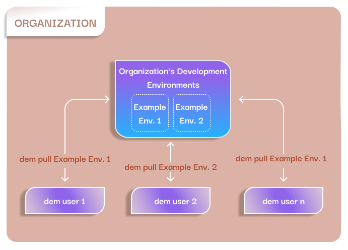

## Definition and supported tools

A set of tools assigned for a software project is called a **Development Environment**.
The dem's functionality is based on the operation on these Development Environments.

Currently the following tool types are supported:

    - Build system
    - Toolchain
    - Debugger
    - Deployer
    - Test framework

When creating a new Development Environment the user can select any of the above tools and then 
assign the required tool images to them. 

!!! tip

    Check out the [`dem create`](commands.md#dem-create-dev_env_name) command to learn more about creating a new Development Environment!

## Tool images

Tool images are the container images that have the specific tools built in. These images can be 
present

- on the host PC
- in a remote registry

!!! Note

    An image registry is a collection of image repositories.
    An image repository stores the different versions of the same image.

## Development Environments available organizations wide

An organization can specify Development Environments which are **available for all of its members**. 

{: .center}

The members can list the available Development Environments in the organization with the 
`dem list --all --env` commmand.  
By default the dem has the axem registry registered. The Development Environments provided by axem
can be installed for free.

!!! warning

    Currently adding other organizations is not supported!

## Installing a Development Environment

Installation can be done with the `dem pull` command:

1. First the dem installs the Development Environment descriptor.
2. Then downloads the tool images that are not yet available on the host PC.

!!! tip

    See the [`dem pull`](commands.md#dem-pull-dev_env_name) command for more details.
